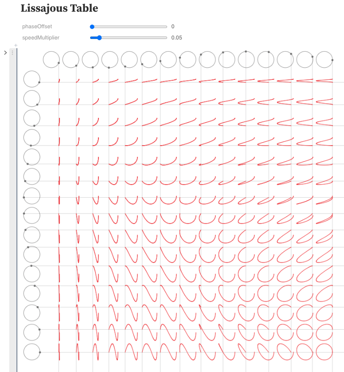
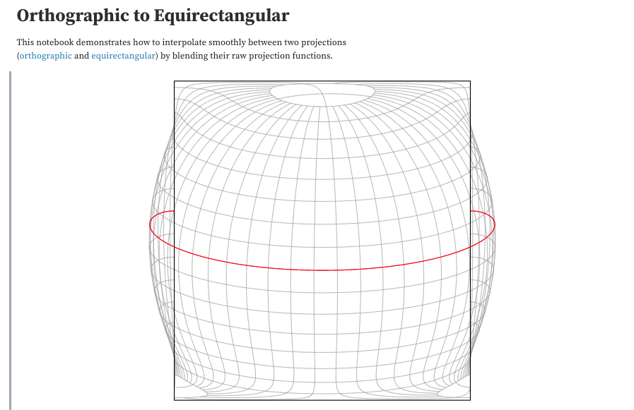

# Overview

Notebooks are **readable documents** that include **text** and **code** to describe or explain an idea.

[Jupyter Notebooks]() and Python tends to be the common language for many of these tools.

**This repository is to help people with JavaScript knowledge get into Python and Notebooks**

# How

[Come Read the Document Here]()

@TODO - link to mybinder

# Why

Personally, I think this is an imazing idea that can help quite a few people.

From:

* [Explaining concepts like Opioid misuse]()

* [Understanding complex math ideas visually - such as Lissajous curves](https://observablehq.com/@sethpipho/lissajous-table)

* [To understanding how maps work](https://observablehq.com/@d3/orthographic-to-equirectangular)

