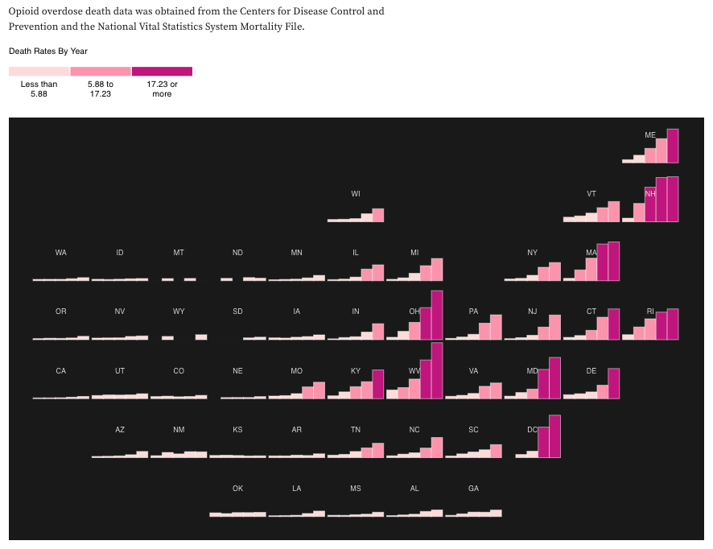

# Overview

Notebooks are **readable documents** that include **text** and **code** to describe or explain an idea.

[Jupyter Notebooks]() and Python tends to be the common language for many of these tools.

**This repository is to help people with JavaScript knowledge get into Python and Notebooks**

# How

[Come Read the Document Here](https://mybinder.org/v2/gh/paulroth3d/python-for-js-developers/HEAD?filepath=p4js.ipynb)

# Why

Personally, I think this is an imazing idea that can help quite a few people.

From:

* [Explaining concepts like Opioid misuse]()

* [Understanding complex math ideas visually - such as Lissajous curves](https://observablehq.com/@sethpipho/lissajous-table)

* [To understanding how maps work](https://observablehq.com/@d3/orthographic-to-equirectangular)

# More

* [Python Documentation](https://docs.python.org/3/)
    * [Python Language Reference](https://docs.python.org/3/reference/index.html)
    * [Python Tutorial](https://docs.python.org/3/tutorial/index.html)
    * [Python Glossary](https://docs.python.org/3/glossary.html)
    * [Python Modules](https://docs.python.org/3/installing/index.html)
    * [Python HowTos](https://docs.python.org/3/howto/index.html)

* [Markdown Table Generator](https://www.tablesgenerator.com/markdown_tables)

* [Jupyter Documentation](https://jupyter.readthedocs.io/en/latest/)

* [Valentino Gagliardi - Python for JavaScript Developers](https://www.valentinog.com/blog/python-for-js/)

# TODO:

[X] Complete all the @TODO replacements
[X] Update the Table of Contents to link to all the major sections
[ ] Check all the links to other sections - as they are case sensitive
[ ] Include a TLDR for each section
[ ] Review with others which sections need a JavaScript refresher
[ ] [Investgatethe toc2 plugin from nbextensions](https://jupyter-contrib-nbextensions.readthedocs.io/en/latest/nbextensions/toc2/README.html)

